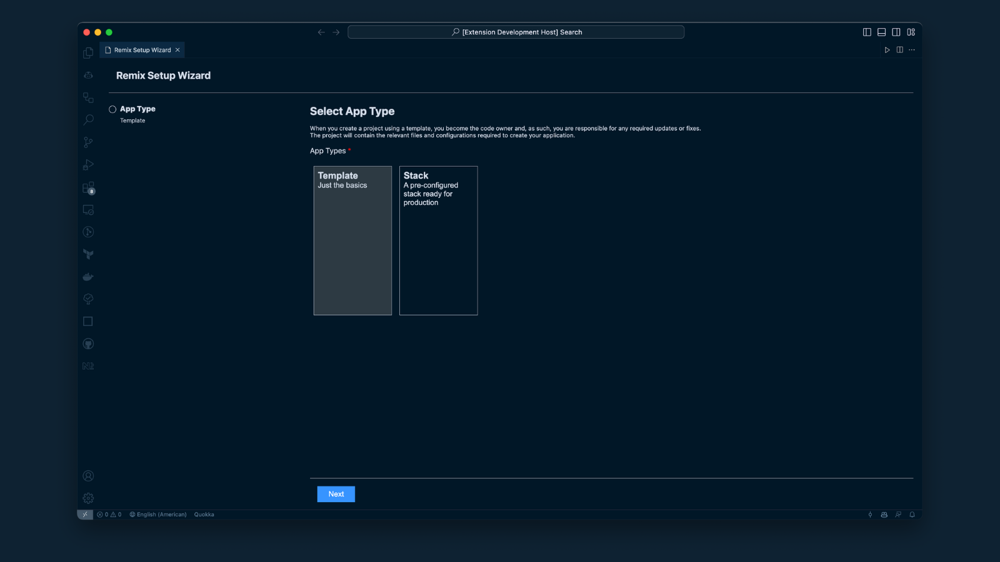
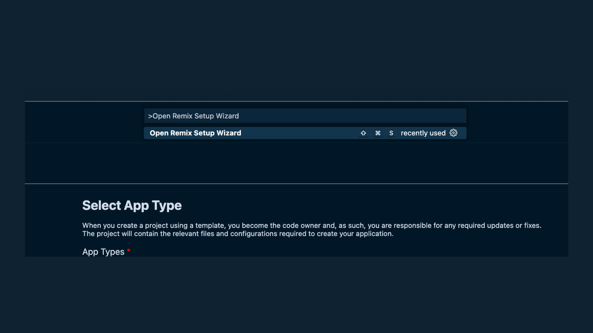

  <picture>
    <source media="(prefers-color-scheme: dark)" srcset="static/remix-wizard-dark.png">
    
  </picture>

# Remix WIZARD

**Spend less time looking up Remix CLI arguments and more time shipping incredible Remix apps.**

## Features

The extension provides the following features:

- Instead of using the CLI, you can now create Remix projects through an intuitive and user-friendly UI.
- You can create a project from either a Template or Stacks as per your preference.

The following commands are available to create a project:

| Command              | Keybinding    | Description                                                             |
| -------------------- | ------------- | ----------------------------------------------------------------------- |
| `remix-wizard.setup` | `Cmd+Shift+C` | Set up a new project from a template through a user-friendly interface. |

The commands are also accessible via the command palette.

## Release Notes

[MIT LICENSE](LICENSE)